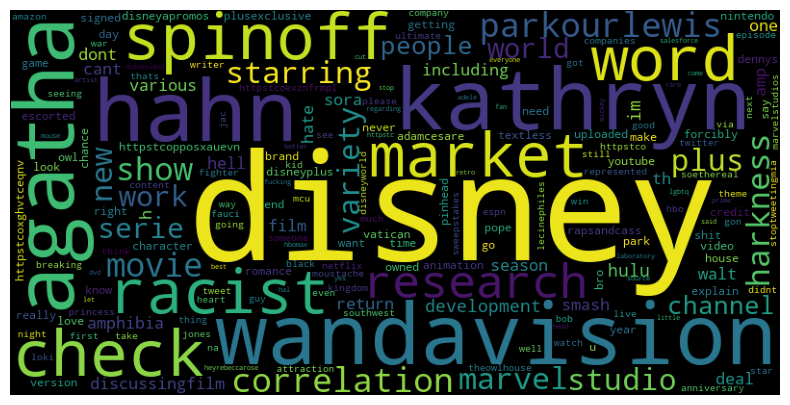
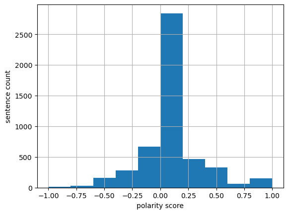
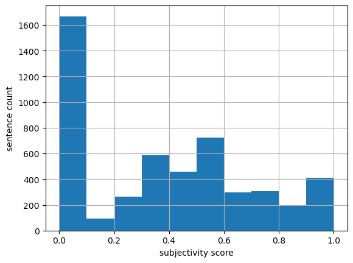

# Social Media Sentiment & Topic Analysis on X

**Key results**
- ~5,000 posts analyzed
- Average polarity: 0.06672
- Average subjectivity: 0.37303
- Influence was highly concentrated among a small number of users
- Discussion clustered around subtopics rather than the keyword alone

This project analyzes ~5,000 social media posts to examine how conversation, sentiment, and influence behave in an unstructured text environment. The focus was on building a pipeline that could extract structure from noisy data and quantify how attention is distributed across users and content.

The raw dataset required non-trivial preprocessing before analysis was meaningful. Text was tokenized using regex-based parsing rather than relying on built-in tokenizers, allowing tighter control over what constitutes a valid token. Stopwords were removed using NLTK, with additional manual filtering applied to eliminate platform-specific noise such as retweet markers, URLs, and low-information tokens. These preprocessing decisions had a visible impact on frequency outputs, particularly when comparing distributions with and without filtering.

To separate content signals from interaction signals, I extracted hashtags and user mentions using regex and flattened them into analyzable structures. Frequency distributions were then computed using Counter and Pandas operations. A consistent pattern was that activity is highly skewed: a small subset of terms and users account for a disproportionate share of the conversation, which makes raw counts misleading.

To address this, I engineered influence metrics at both the user and tweet level. User influence was defined as a function of follower count, friends count, listed count, and favourites count, while tweet-level influence aggregated replies, retweets, quotes, and likes. Using a simple additive formulation allowed ranking entities based on estimated visibility rather than frequency alone.

For example, the most influential user in the retweet subset was Christina Aguilera, with an influence score exceeding 16 million, despite not being among the most active contributors. In contrast, the most frequent tweeting user contributed 40 posts but did not appear in the top influence rankings. This highlights a clear distinction between activity and visibility: users who post the most are not necessarily the ones shaping the conversation. One limitation of this approach is that all engagement types are weighted equally, which may not fully reflect how different interactions contribute to reach.

This pattern is reinforced at the content level. High-frequency tokens such as “rt” indicate that much of the activity is driven by retweet amplification rather than original content generation. At the same time, terms like “wandavision”, “agatha”, and “spinoff” suggest that discussion clusters around specific subtopics rather than the keyword itself.

Sentiment analysis was implemented using TextBlob to compute polarity and subjectivity scores for each post. While the average polarity was slightly positive (~0.067), the distribution was wide and centered near neutral, making the mean a weak summary statistic. Extreme values were more informative than the mean: positive sentiment was generally tied to entertainment-driven engagement, while negative sentiment appeared in more targeted critiques. This also highlights a limitation of lexicon-based sentiment models, which tend to flatten context and nuance, particularly in short-form social media text.

From a data handling perspective, working with filtered DataFrame slices introduced common pitfalls such as chained assignment warnings (SettingWithCopyWarning). Addressing this required explicit indexing with `.loc[]`, which is important for ensuring transformations behave as expected in larger pipelines.

Overall, the analysis shows that conversation around a single keyword is fragmented, influenced by a small number of high-visibility users, and structured around subtopics rather than the keyword itself. Extracting meaningful insight requires combining text-level preprocessing with user-level feature engineering rather than relying on isolated summary metrics.

## Outputs

**Word Cloud**  

**Polarity Distribution**  

**Subjectivity Distribution**  

